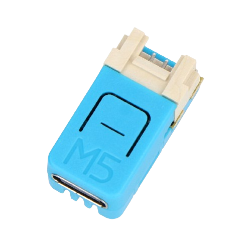

<!-- PROJECT LOGO -->
<br />
<p align="center">
  <a href="https://github.com/dj1ch/ieee802154-sniffer">
    
  </a>

  <h3 align="center">ieee802154-sniffer</h3>

  <p align="center">
    and yet another proof of concept sniffer using the IEEE 802.15.4 standard
    <br />
    <a href="https://github.com/dj1ch/ieee802154-sniffer"><strong>Explore the docs »</strong></a>
    <br />
    <br />
    <a href="https://github.com/dj1ch/ieee802154-sniffer">View Demo(TBA)</a>
    ·
    <a href="https://github.com/dj1ch/ieee802154-sniffer/issues">Report Bug</a>
    ·
    <a href="https://github.com/dj1ch/ieee802154-sniffer/issues">Request Feature</a>
  </p>
</p>


<!-- TABLE OF CONTENTS -->
## Table of Contents

* [About the Project](#about-the-project)
  * [Built With](#built-with)
* [Getting Started](#getting-started)
  * [Prerequisites](#prerequisites)
  * [Installation](#installation)
* [Usage](#usage)
* [Roadmap](#roadmap)
* [Contributing](#contributing)
* [License](#license)
* [Contact](#contact)
* [Acknowledgements](#acknowledgements)

<!-- ABOUT THE PROJECT -->
## About The Project

This proof of concept demonstrates how an ESP32C6 (or any other ESP32 with support for the IEEE 802.15.4 standard) can sniff for packets much like how a normal device using the IEEE 802.11 standard might operate.

Although mesh networks such as that of established by the IEEE 802.15.4 standard are inheritely more secure than those created by WiFi or any other related protocol, activity on such meshes can be seen, to an extent. This project showcases the extent it could really go to, in this case, usually just some data with a source address attached (if the device is in range anyway).

**As a developer, I do not endorse the illegal use of this firmware. Any sort of trouble you get into I am not responsible for!!!**

### Built With

* [esp-idf@v5.3](https://github.com/espressif/esp-idf/tree/v5.3)
* [M5NanoC6](https://shop.m5stack.com/products/m5stack-nanoc6-dev-kit) or any other ESP32 with support for the IEEE 802.15.4 standard.

<!-- GETTING STARTED -->
## Getting Started

To get a local copy up and running follow these simple steps.

### Prerequisites

### Installation

1. Clone the repo

```sh
git clone https://github.com/dj1ch/ieee802154-sniffer.git
```

2. Install `esp-idf`: Follow [documentation](https://docs.espressif.com/projects/esp-idf/en/latest/esp32/get-started/#installation) and install version 5.3.

3. Set board target

```sh
idf.py set-target <your_esp32*_board>
```

If it asks that you delete the build directory or `sdkconfig`, you will need to do that to compile for that board.

4. Build the project

```sh
idf.py build
```

5. Flash to your ESP32(replace `PORT` with the port connected to your ESP32)

```sh
idf.py -p PORT flash
```

or you can run

```sh
idf.py flash
```

<!-- USAGE EXAMPLES -->
## Usage

Sniffer command list:

* `start_sniffer`: Starts the sniffer.
* `stop_sniffer`: Stops the sniffer.
* `current_channel`: Returns your current channel.
* `set_channel <channel>`: Switches channel. Replace `<channel>` with the channel you intend on switching to (must be an integer from 11-26).

<!-- ROADMAP -->
## Roadmap

As of now I would like to implement/am in the progress of implementing:

* Video demo

See the [open issues](https://github.com/dj1ch/ieee802154-sniffer/issues) for a list of proposed features (and known issues).

<!-- CONTRIBUTING -->
## Contributing

Contributions are what make the open source community such an amazing place to be learn, inspire, and create. Any contributions you make are **greatly appreciated**.

1. Fork the Project
2. Create your Feature Branch (`git checkout -b feature/AmazingFeature`)
3. Commit your Changes (`git commit -m 'Add some AmazingFeature'`)
4. Push to the Branch (`git push origin feature/AmazingFeature`)
5. Open a Pull Request

<!-- LICENSE -->
## License

Distributed under the MIT License. See `LICENSE` for more information.

<!-- CONTACT -->
## Contact

dj1ch - tg.1ch0712@gmail.com

Project Link: [https://github.com/dj1ch/ieee802154-sniffer](https://github.com/dj1ch/ieee802154-sniffer)

<!-- ACKNOWLEDGEMENTS -->
## Acknowledgements

* [Espressif](https://github.com/espressif/)
* [ESP-IDF Documentation for IEEE 802.15.4](https://docs.espressif.com/projects/esp-idf/en/stable/esp32h2/migration-guides/release-5.x/5.1/ieee802154.html)
* [ESP32 Basic Console example](https://github.com/espressif/esp-idf/tree/v5.3/examples/system/console/basic)
* [This Github issue](https://github.com/espressif/esp-idf/issues/11549)
* And many more...!